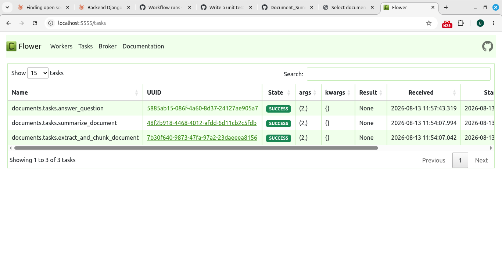

# Document Summarizer

An async document summarization and Q&A backend built with Django, Django REST Framework, and Celery. Upload a PDF, and a background task pipeline extracts its text, chunks it, and generates a summary via the Anthropic API — all off the request/response cycle. Ask follow-up questions against any processed document and get answers grounded in its content.

Built as a portfolio project to demonstrate backend patterns beyond basic CRUD: async task pipelines, task chaining and retries, ownership-scoped REST APIs, and a fully containerized, multi-service local dev environment.

## Features

- **Async processing pipeline** — PDF upload triggers a chain of Celery tasks (extract → chunk → summarize) that run entirely in the background. The API responds immediately (`202 Accepted`); clients poll for status.
- **Q&A over documents** — ask questions against any fully-processed document; answers are generated asynchronously using the document's extracted text as context.
- **Bring-your-own-key** — the API never stores or bills against a shared LLM key. Every request that triggers an LLM call requires the caller's own Anthropic API key, passed via an `X-Anthropic-Api-Key` header. See [Design notes](#design-notes) for the tradeoffs this involves.
- **Retry and failure handling** — each pipeline stage records its own failure state (`status`, `error_message`) and retries transient failures automatically, while failing fast (no retry) on non-retryable errors like an invalid API key.
- **Ownership-scoped API** — every endpoint scopes queries to the requesting user; documents and questions are never visible across accounts.
- **Fully containerized** — one `docker compose up` brings up Django, Postgres, Redis, a Celery worker, and a Flower monitoring dashboard.
- **36 automated tests** covering models, serializers, views, and Celery tasks — including retry paths and ownership-scoping edge cases.

## Architecture

```
Client
  │  POST /api/documents/upload/ (file + X-Anthropic-Api-Key header)
  ▼
Django REST Framework  ──▶  Postgres (Document, Chunk, Summary, Question)
  │
  │  .delay()
  ▼
Celery Worker (Redis broker)
  │
  ├─ extract_and_chunk_document  → pypdf text extraction, chunking
  │       │
  │       └─ chains into ─▶ summarize_document  → Anthropic API call
  │
  └─ answer_question  → Anthropic API call using document chunks as context
```

Each task updates the relevant row's `status`/`error_message` as it progresses, so clients can poll `GET /api/documents/<id>/` or `GET /api/questions/<id>/` to track progress without any additional infrastructure (webhooks, websockets) — a deliberately simple choice for this project's scope.

## Tech stack

- **Backend**: Django, Django REST Framework
- **Async tasks**: Celery, Redis (broker + result backend)
- **Database**: PostgreSQL
- **PDF processing**: pypdf
- **LLM**: Anthropic API (user-supplied key)
- **Monitoring**: Flower
- **Containerization**: Docker, Docker Compose
- **Testing**: Django's test framework (`unittest`-based), DRF's `APITestCase`, `unittest.mock`

## Screenshots

### Flower dashboard — live task monitoring



*Real task activity from the pipeline: `extract_and_chunk_document`, `summarize_document`, and `answer_question` executing via the Celery worker, monitored through Flower at `localhost:5555`.*

## API endpoints

All endpoints (except the token endpoint) require `Authorization: Token <token>`. Endpoints that trigger an LLM call also require `X-Anthropic-Api-Key: <your-anthropic-key>`.

| Method | Endpoint | Description |
|---|---|---|
| POST | `/api/auth/token/` | Obtain an auth token (username + password) |
| POST | `/api/documents/upload/` | Upload a PDF; enqueues extraction + summarization |
| GET | `/api/documents/` | List the authenticated user's documents |
| GET | `/api/documents/<id>/` | Document detail, including nested summary once processed |
| POST | `/api/documents/<id>/questions/` | Ask a question against a fully-processed document |
| GET | `/api/documents/<id>/questions/` | List questions asked against a document |
| GET | `/api/questions/<id>/` | Poll a single question for its answer |

## Getting started

Requires Docker and Docker Compose.

```bash
git clone <repo-url>
cd Summarizer
docker compose up --build
```

In a separate terminal, run migrations and create a user:

```bash
docker compose exec web python manage.py migrate
docker compose exec web python manage.py createsuperuser
```

Services:

- Django API: `http://localhost:8000`
- Flower dashboard: `http://localhost:5555`
- Django admin: `http://localhost:8000/admin/`

### Example: upload a document and ask a question

```bash
# Get a token
curl -X POST http://localhost:8000/api/auth/token/ \
  -d "username=<you>&password=<your-password>"

# Upload a PDF
curl -X POST http://localhost:8000/api/documents/upload/ \
  -H "Authorization: Token <token>" \
  -H "X-Anthropic-Api-Key: <your-anthropic-key>" \
  -F "file=@/path/to/document.pdf"

# Poll for status
curl http://localhost:8000/api/documents/1/ -H "Authorization: Token <token>"

# Ask a question once status is "done"
curl -X POST http://localhost:8000/api/documents/1/questions/ \
  -H "Authorization: Token <token>" \
  -H "X-Anthropic-Api-Key: <your-anthropic-key>" \
  -H "Content-Type: application/json" \
  -d '{"question_text": "What is this document about?"}'
```

## Running tests

```bash
docker compose exec web python manage.py test
```

36 tests across models, serializers, views, and Celery tasks, including:
- Ownership-scoping (users can't access each other's documents/questions)
- Retry and failure-state behavior for each pipeline stage
- Mocked Anthropic API calls (no real API key or network access required to run the suite)

## Design notes

**Bring-your-own-key, not a shared API key.** Rather than pay for a shared Anthropic API key to keep a public demo running indefinitely, this project requires each request to supply its own key via an `X-Anthropic-Api-Key` header. The key is used to construct a fresh `anthropic.Anthropic` client per task call and is never persisted to the database or logged.

Known tradeoff: because Celery serializes task arguments (including the API key) into messages sent through Redis, the key briefly exists in the broker's memory as part of the queued task payload. This is an acceptable tradeoff for a demo/portfolio project but would need addressing in a production system — e.g. storing an encrypted key server-side and passing only a reference/ID through the task queue, or using a short-lived token exchange.

**Full-document summarization, not chunk-by-chunk.** Chunks are reassembled into the full document text before being sent to the LLM in a single prompt. This keeps the pipeline simple but means very large documents could exceed the model's context window — a map-reduce style chunk-by-chunk summarization (summarize each chunk, then summarize the summaries) would be the next step to handle that case.

**No real-time push (websockets/webhooks).** Clients poll for status. This was a deliberate scope decision — polling is simpler to build, test, and reason about, and is a reasonable choice for a project at this scale. A production version handling many concurrent users might add websocket-based push notifications instead.

## Possible future improvements

- Multi-provider LLM support (OpenAI, etc.) behind a common interface
- Map-reduce summarization for documents exceeding context window limits
- Encrypted server-side storage of API keys instead of per-request headers
- WebSocket-based status push instead of polling